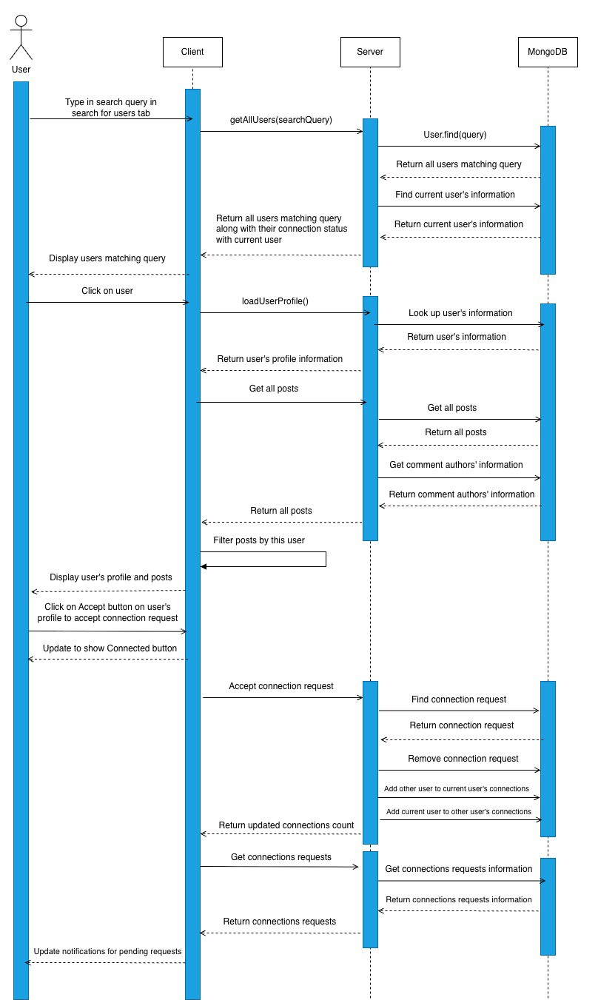

# LinkU - Lightweight LinkedIn-style Network App

A student/alumni networking app with authentication, profiles, posting, comments, likes, connections, and search.

---

## What it does
1. **Auth**
   - Sign up
   - Verify password rules
   - Log in / log out
   - Access protected pages

2. **Profiles**
   - Edit name, position, location, about, education, skills, avatar URL
   - View your own profile page
   - View other users' profiles

3. **Feed & Posts**
   - Create posts
   - Like / unlike posts
   - Comment on posts
   - Reply to comments with infinite-depth threads
   - Delete your own posts and comments

4. **Connections**
   - Send / accept / decline connection requests
   - View **My Network**
   - See a notifications badge for new requests

5. **Search**
   - Find users by name / email / position
   - Search posts by text or author

6. **Direct Messaging**
   - One-to-one private DM between users
   - Accessible through a Message button on profiles, user cards
   - Conversation list, message window UI

---

## Requirements

- **Node.js** (tested on `v22.21.0`)
- **npm** (tested on `10.9.4`)
- macOS / Linux recommended  
- Windows users: WSL2 is recommended for smooth Node tooling

---

## Environment Variables

Create a `.env` file in **backend/**:
```env
PORT=4000
JWT_SECRET=YOUROWNSECRETWORD
```


Create a `.env` file in **frontend/** with:
```env
VITE_API_BASE_URL=http://localhost:4000
```

## Install:
Run 
```bash
./setup.sh
``` 
for a one-step setup. If you prefer doing it manually, run the following commands from the repo root:
```bash
cd backend && npm install
cd ../frontend && npm install
cd ..
```
---
## Run(dev):
At repo root:
```bash
./dev.sh
```

This starts Backend on http://localhost:4000 and Frontend on http://localhost:5173

---
## Tests:
We use Playwright E2E tests:

1. Install test deps in repo root:
```bash
npm install -D @playwright/test
npx playwright install
```
2. Ensure the frontend/backend are running, and run tests. (If you fail on the tests, try to restart the app.)

## Sequence Diagram



Diagram Description: When the user types in a search query and is on the tab to view results for users matching the search, the server gets all users matching the search query and the information of the current user from the database. Then a list of users profiles matching the search is displayed, each with a button that shows their connection status with the current user. When the user clicks on the profile of one of the users of the search results, the server gets this user’s profile information, all posts, and all comments from the database, then the posts are filtered to only display posts by this user on the user’s profile page, along with the user’s profile. The user sees the “Accept” button on the other user’s profile, so they know this user has sent them a connection request and they click the button to accept their request. The button changes to show the users are now connected. The server finds this connection request in the database and removes it from the database. The server adds the other user to the current user’s connections list and the current user to the other user’s connections list in the database. Then the server gets the new list of connection requests from the database and the notifications for pending connection requests are updated. 


